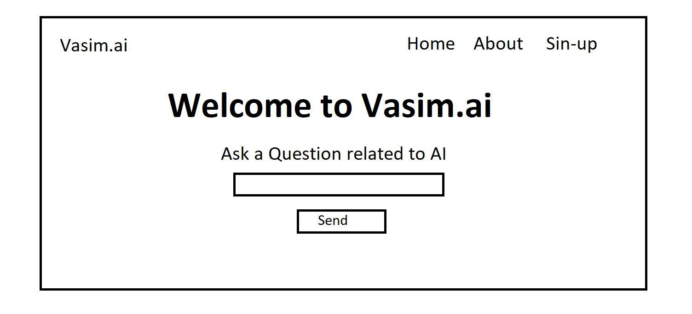

# PenPalSite - Design to Website App

PenPalSite is a Streamlit application designed to convert image layouts into HTML code. It utilizes OCR (Optical Character Recognition) to extract layout information from uploaded images and generates corresponding HTML code.

## Sample sketch


##########################################################################
## Generated webtite


##########################################################################

## Installation

To run PenPalSite locally, follow these steps:

1. Clone the repository:

   ```bash
   git clone https://github.com/shaikh-vasim/PenPalSite.git
   ```

2. Navigate to the project directory:

   ```bash
   cd PenPalSite
   ```

3. Create a Conda environment (replace `myenv` with your desired environment name):

   ```bash
   conda create -n myenv python=3.10
   ```

4. Activate the Conda environment:

   ```bash
   conda activate myenv
   ```

5. Install dependencies:

   ```bash
   pip install -r requirements.txt
   ```

6. Set up environment variables:

   Create a `.env` file in the project directory and add your Google API key:

   ```
   GOOGLE_API_KEY=your_google_api_key_here
   ```

7. Run the PenPalSite application using Streamlit:

   ```bash
   streamlit run app.py
   ```

Now you should be able to access PenPalSite locally in your web browser.

### Functionality

- **Upload an image:** Upload an image containing a layout design.
- **Generate code:** Convert the uploaded image into HTML code.
- **View Output:** View the generated HTML output.
- **Download HTML:** Download the generated HTML code.

## Dependencies

- [OCRImgs](https://github.com/ocrimgs/ocr): A library for Optical Character Recognition.
- [Streamlit](https://streamlit.io/): A Python library for creating web apps.
- [Pillow](https://python-pillow.org/): Python Imaging Library (PIL fork) for image processing.
- [Google Generative AI](https://github.com/google/generativeai): Google's library for generative AI.
- [Dotenv](https://github.com/theskumar/python-dotenv): Library for managing environment variables from a .env file.

## Additional Use Cases

### Web Designers and Developers
PenPalSite can be a valuable tool for web designers and developers who want to quickly prototype their ideas or convert hand-drawn sketches into functional HTML code. By simply uploading an image of their design, they can generate HTML code that closely matches their vision, saving time and effort in the development process.

### Graphic Designers
Graphic designers often create mockups and layouts using design software or by hand. With PenPalSite, they can easily translate these visual designs into HTML code without needing to manually code every element. This allows designers to focus on the creative aspects of their work while PenPalSite handles the technical implementation.

### Students and Educators
Students learning web development and design can use PenPalSite to practice converting visual layouts into HTML code. By experimenting with different designs and seeing the corresponding HTML output, students can deepen their understanding of web development concepts and improve their coding skills. Educators can also incorporate PenPalSite into their curriculum as a hands-on tool for teaching HTML and web design principles.

### Freelancers and Small Businesses
Freelancers and small businesses with limited resources may not have access to professional web design tools or expertise. PenPalSite provides an accessible and user-friendly solution for creating basic websites or prototypes without the need for expensive software or specialized knowledge. This empowers freelancers and small businesses to establish an online presence quickly and affordably.

### UX/UI Designers
UX/UI designers can use PenPalSite to bridge the gap between their design mockups and the final implementation. By generating HTML code from their designs, designers can validate their ideas and ensure that the intended user experience is accurately translated into a functional website. This iterative process helps designers refine their designs and deliver a better user experience.

### Non-Technical Users
Even users with limited technical knowledge can benefit from PenPalSite's simplicity and ease of use. Whether they're hobbyists experimenting with web design or entrepreneurs looking to create a basic website, PenPalSite provides an intuitive platform for bringing their ideas to life without needing to learn complex coding languages or design software.

## Contributing

Contributions to the PenPalSite are welcome! If you'd like to contribute to the project, please follow these steps:

1. Fork the repository to your own GitHub account.

2. Create a new branch for your feature or bug fix.

3. Make your changes and ensure that the code passes all tests.

4. Create a pull request to the main repository, explaining your changes and improvements.

5. Your pull request will be reviewed, and if approved, it will be merged into the main codebase.

## License

This project is licensed under the terms of the MIT License. See the [LICENSE](LICENSE) file for details.
```

This README file now includes instructions for setting up a Conda environment before running the application. Let me know if you need further assistance!